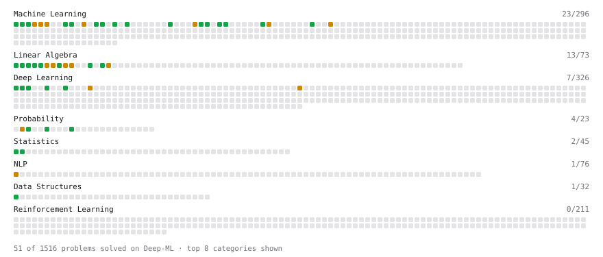

# Deep-ML

My machine learning practice from [Deep-ML](https://www.deep-ml.com). Every solution here was written by hand.

**16** solved · 16 problems · 0 labs · 0 math

[**Browse the interactive portfolio**](https://kkrit-tinna.github.io/deep-ml/) to replay this filling in over time.

## Problems

| | Difficulty | Solved | |
| --- | --- | --- | --- |
| [Calculate Covariance Matrix](https://www.deep-ml.com/problems/10) | easy | 2025-03-15 | [solution](problems/0010-calculate-covariance-matrix) |
| [Calculate Mean by Row or Column](https://www.deep-ml.com/problems/4) | easy | 2025-03-19 | [solution](problems/0004-calculate-mean-by-row-or-column) |
| [Descriptive Statistics Calculator](https://www.deep-ml.com/problems/78) | easy | 2025-03-22 | [solution](problems/0078-descriptive-statistics-calculator) |
| [Feature Scaling Implementation](https://www.deep-ml.com/problems/16) | easy | 2025-03-20 | [solution](problems/0016-feature-scaling-implementation) |
| [Linear Regression Using Gradient Descent](https://www.deep-ml.com/problems/15) | easy | 2025-03-13 | [solution](problems/0015-linear-regression-using-gradient-descent) |
| [Linear Regression Using Normal Equation](https://www.deep-ml.com/problems/14) | easy | 2025-03-14 | [solution](problems/0014-linear-regression-using-normal-equation) |
| [Matrix-Vector Dot Product](https://www.deep-ml.com/problems/1) | easy | 2025-03-12 | [solution](problems/0001-matrix-vector-dot-product) |
| [Random Shuffle of Dataset](https://www.deep-ml.com/problems/29) | easy | 2025-03-21 | [solution](problems/0029-random-shuffle-of-dataset) |
| [Reshape Matrix](https://www.deep-ml.com/problems/3) | easy | 2025-03-18 | [solution](problems/0003-reshape-matrix) |
| [Scalar Multiplication of a Matrix](https://www.deep-ml.com/problems/5) | easy | 2025-03-25 | [solution](problems/0005-scalar-multiplication-of-a-matrix) |
| [Sigmoid Activation Function Understanding](https://www.deep-ml.com/problems/22) | easy | 2025-03-29 | [solution](problems/0022-sigmoid-activation-function-understanding) |
| [Softmax Activation Function Implementation ](https://www.deep-ml.com/problems/23) | easy | 2025-03-29 | [solution](problems/0023-softmax-activation-function-implementation) |
| [Transpose of a Matrix](https://www.deep-ml.com/problems/2) | easy | 2025-03-12 | [solution](problems/0002-transpose-of-a-matrix) |
| [Calculate Eigenvalues of a Matrix](https://www.deep-ml.com/problems/6) | medium | 2025-03-26 | [solution](problems/0006-calculate-eigenvalues-of-a-matrix) |
| [Implement K-Fold Cross-Validation](https://www.deep-ml.com/problems/18) | medium | 2025-03-27 | [solution](problems/0018-implement-k-fold-cross-validation) |
| [K-Means Clustering](https://www.deep-ml.com/problems/17) | medium | 2025-03-27 | [solution](problems/0017-k-means-clustering) |

---

_This file is regenerated by Deep-ML on every push._
